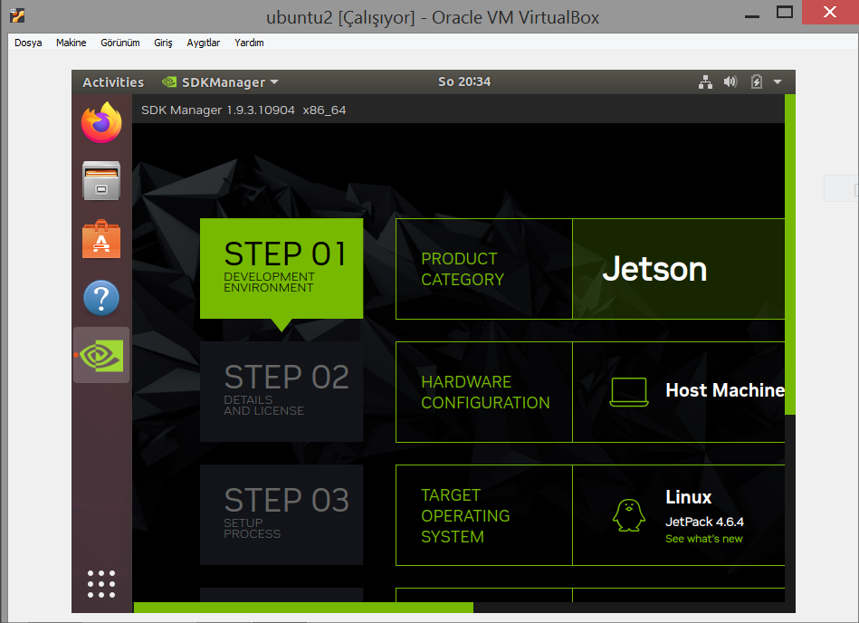

# Details of NVIDIA Jetson Nano Setup
In this section, I have collected the errors and problems that I encountered during the whole process. Just to guide more easily and quickly to myself and other people in the future.

 

### Docker
- I created my Docker Image based on the image [dustynv/tensorflow2](https://hub.docker.com/r/dustynv/tensorflow2/tags). But there was a conflich between Keras and TensorFlow. It gave the error : `cannot import name 'dtensor'`

- [The solution](https://stackoverflow.com/questions/72093082/importerror-cannot-import-name-dtensor) is install Keras 2.6 The related 

---

### TensorFlow

- [Official TensorFlow release for Jetson Nano](https://forums.developer.nvidia.com/t/official-tensorflow-for-jetson-nano/71770)

- [Alternative method](https://forums.developer.nvidia.com/t/cant-install-h5py-on-jetpack-4-3/144272/9) to install h5py _(It generally created problems during the installation of TensorFlow_

---

### ONNX

- TensorFlow Saved Models are not converted directly into TensorRT models. We need ONNX models as intermediate step. The [Nvidia forum post](https://forums.developer.nvidia.com/t/keras-pb-model-to-tensorrt-engine-conversion/191242/5) about this topic. 

- If you use `opset 14` option during the conversation of TensorFlow model into ONNX model, when you try to convert this ONNX model into TensorRT model, it gives error. Because this is not supported by TensorRT yet. Therefore you should use `opset 13`. The [solution in the forum](https://forums.developer.nvidia.com/t/tensorrt-parsing-onnx-model-error/194884/9)

---

### TensorRT

- To be able to use TensorRT which is preinstalled in Jetpack, we should make the setup with SDK Manager. The [forum post about this.](TensorRThttps://forums.developer.nvidia.com/t/jetson-nano-tensorrt-python-import-error/107831/4)

  You need to have Ubuntu _( [more details](https://developer.nvidia.com/sdk-manager) )_ in local machine to use SDK Manager and then you can install the packages to Jetson. Therefore I installed VirtualBox in my computer and install Ubuntu in here. VirtualBox is open source free software to install another operating system in your computer. You can watch this [Youtube video](https://www.youtube.com/watch?v=sB_5fqiysi4&ab_channel=BrettInTech) for its setup.

  I connect my computer and Jetson Nano to my router with Ethernet cable. If you have Data Cable, you can connect Jetson Nano to your computer with USB. In the Youtube videos [Video1](https://www.youtube.com/watch?v=Ucg5Zqm9ZMk&t=2s&ab_channel=JetsonHacks) and [Video2](https://www.youtube.com/watch?v=D0v1q-HUM4o&list=PLWw98q-Xe7iF6gMaE7Yv8ATbe0z78O9yG&index=4) you can find more details about NVIDIA SDK Manager.
  

- To convert ONNX model into TensorRT models, we need `trtexec`. But it in a folder, thus it gives error, when we used in the terminal. [The solution is in here.](https://forums.developer.nvidia.com/t/bash-trtexec-command-not-found/127302/6)

- The more details about TensortRT Models(FP32 model, FP16 model, INT8) as [Colab Notebook](https://colab.research.google.com/github/vinhngx/tensorrt/blob/vinhn-tf20-notebook/tftrt/examples/image-classification/TFv2-TF-TRT-inference-from-Keras-saved-model.ipynb#scrollTo=G2F8t6cPkVQS) 

---

### Other

- To install PyCUDA, `bashrc` should be modified. The [solution1](https://forums.developer.nvidia.com/t/cant-install-pycuda-on-jetson-nano/217516/2) and [solution2](https://forums.developer.nvidia.com/t/pycuda-error-in-jetson-nano/83782/5)

- `Illegal Instruction (Core Dump)` error because of OpenCV. [Its solution is in here.](https://forums.developer.nvidia.com/t/opencv-import-fails-with-illegal-instruction-core-dump/168060). Also always import _"cv2"_ before the tensorflow. It might also creates error.

- If you have problem with Jetpack, you might need to install ` nvidia-container`. [The forum post]( https://forums.developer.nvidia.com/t/problem-with-jetpack/241169/2)

- Resolution problem, when you connect to Jetson via VNC Server. [The solution](https://forums.developer.nvidia.com/t/640x480-for-vnc-offer-more-choices/158713/6) is creating a fake screen.
