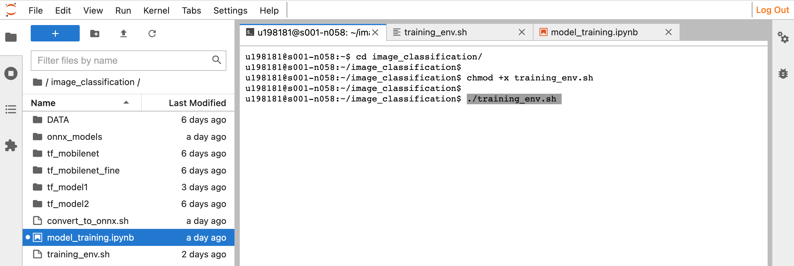

# Intel Developer Cloud

Since I don't have suitable Intel Hardware, I have made all the test on Intel Developer Cloud. We can [sign up](https://devcloud.intel.com/oneapi/home/) and use the Intel oneAPI toolkits and Intel hardwares free for 120 days.


After registration, we should connect to DevCloud. There are two ways :  
1 - There is a part **"Connect with JupyterLab\"** at the end of this [website](https://devcloud.intel.com/oneapi/get_started/). By simply clicking _"Launch JupyterLab"_, we can connect to Intel DevCloud.

</br>

2 - From Terminal via **SSH**

As seen in the below picture, we should choose our operating system and download private SSH key file. For the sake of simplicity, I suggest to follow instructions in _"Automated Configuration"_ section.

<p align="center">

</p>

---

</br>

# Create Virtual Environments and Kernel from Shell Script File

I will continue with JupyterLab since it is easier to visualize. 

I created 2 shell script files which adjust everythings automatically(installing the packages, creating the kernel and etc.) Firstly, you can create a folder and put all necassary files as in the figure below and you can run the `.sh`files in terminal like this : _(Do not forget to change the directory where the script is located)_

<p align="center">

</p>

Make the Script Executable
```
chmod +x training_env.sh
```

Run the Script
```
./training_env.sh
```

</br>
</br>

Details about 2 Script Files : 

- training_env : Responsible for Model training with Intel Tensorflow Extension.
- convert_to_onnx : Responsible for converting TensorFlow models into ONNX format.

*( Note : Intel Tensorflow Extension is only compatible with TensorFlow v2.13.0 according to its [documentation.](https://github.com/intel/intel-extension-for-tensorflow/blob/main/docs/install/install_for_cpu.md#install-tensorflow)*

*But the `tf2onnx` library which is used to convert saved TensorFlow model into ONNX format, does not work with this version. At the time I created this document, it was only working with TensorFlow v2.12.0*

*Therefore "convert_to_onnx" shell file uses v2.12.0 TensorFlow. The more detail about this script can be found in [Model Training part.](sections/model_training.md) )*

---
</br>

# Details about Intel DevCloud 

Normally, after you run the shell script files, you can select the Kernel on the top menu of JupyterLab and you can run the codes cell by cell.

But if you want to learn the details, you can check the following two sections : 

* The details of _Shell Script_ files above(setting up a kernel from created virtual environment) can be found in the section [Setting up the Kernel](kernel.md)

* The another method to run the codes(creating a job script, submit it queue, specify CPU node, GPU core etc.) and its details can be found in the section [Run the code and Job Script](job.md)
