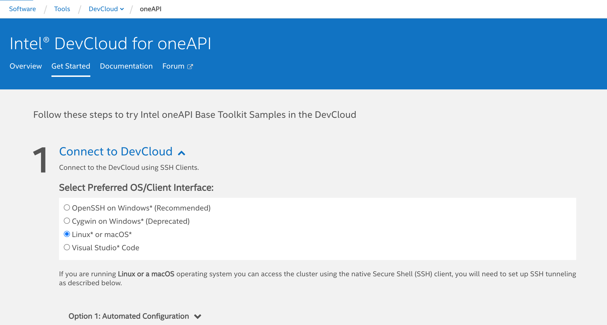

# Intel Developer Cloud

Since I don't have suitable Intel Hardware, I have made all the test on Intel Developer Cloud. We can [sign up](https://devcloud.intel.com/oneapi/home/) and use the Intel oneAPI toolkits and Intel hardwares free for 120 days.

After registration, we should connect to DevCloud. There are two ways :  
1 - There is a part **"Connect with JupyterLab\*"** at the end of this [website](https://devcloud.intel.com/oneapi/get_started/). By simply clicking _"Launch JupyterLab"_, we can connect to Intel DevCloud.

2 - As seen in the below picture, we should choose our operating system and download private SSH key file. For the sake of simplicity, I suggest to follow instructions in _"Automated Configuration"_ section.

