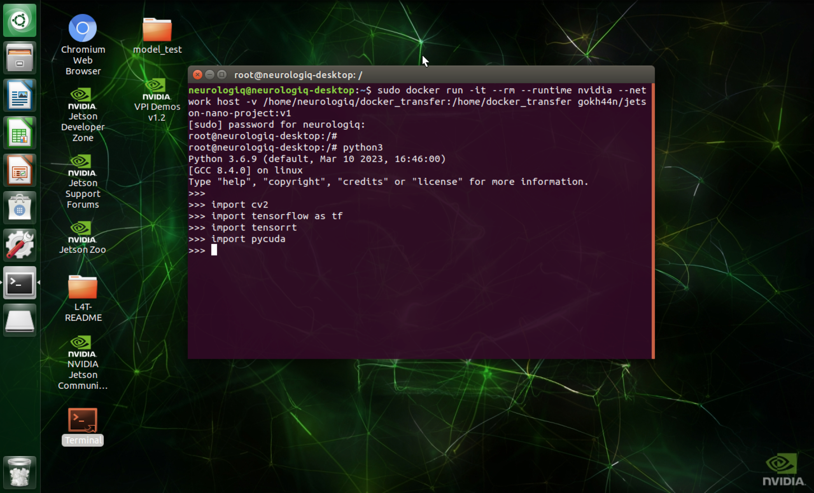

# NVIDIA Jetson Nano

I created a Docker image which contains all necessary packages for this project. You can pull it [from this link](https://hub.docker.com/r/gokh44n/jetson-nano-project) and start to use.

<p align="center">

</p>

* Start with following commands : 
```
sudo docker run -it --rm --runtime nvidia --network host
```
</br>

* Connect the folder in your home directory into Docker container. _(For example, in my home directory I created "docker_transfer" folder and I put all files in there. Later I mount this folder in Docker container. In this way, when I start the container, I can reach and use all files)_ 
```
-v /home/neurologiq/docker_transfer:/home/docker_transfer
(Before ":" you write folder in your home directory, After it you specify where it will be visible in container.
You can adjust a same name folder for simplicity.)
```
</br>

* Type Docker image name with tag :
```
gokh44n/jetson-nano-project:v1
```
</br>

When you type these commands completely, you will be asked your password. Then command line starts with "root" which means you are inside the container. Now you should switch to directory where your files located are. You can see the whole process on the above figure.

---

Normally, everything is ready in this container to run the projects. But in this section, you can find the [Details of NVIDIA Jetson Nano Setup.](XXX) I have collected the errors and problems that I encountered during the whole process. Just to guide more easily and quickly to myself and other people in the future.


