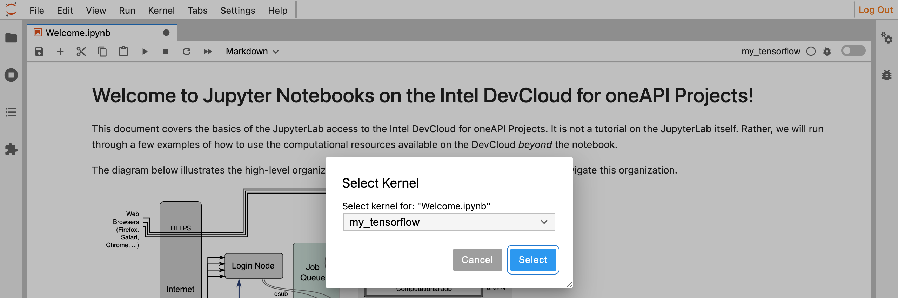
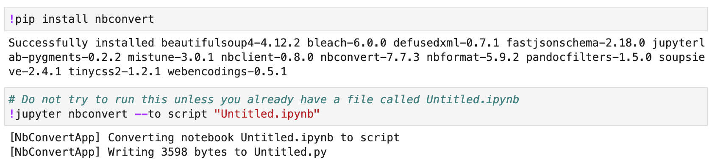
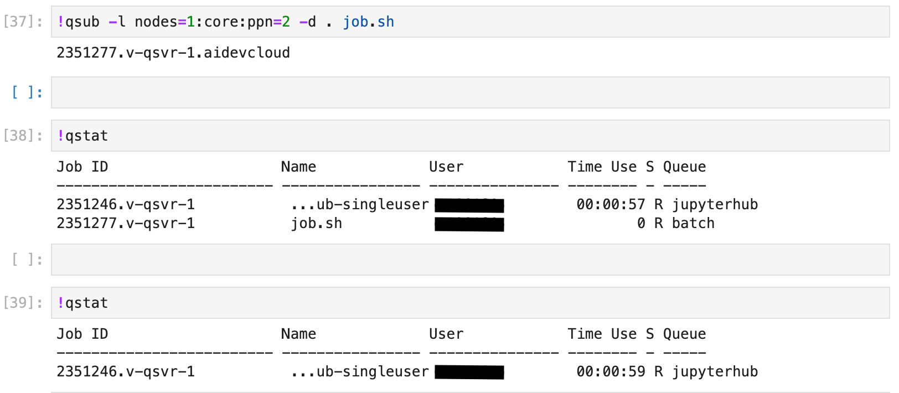
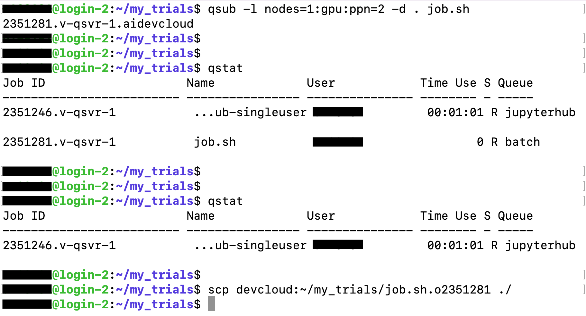
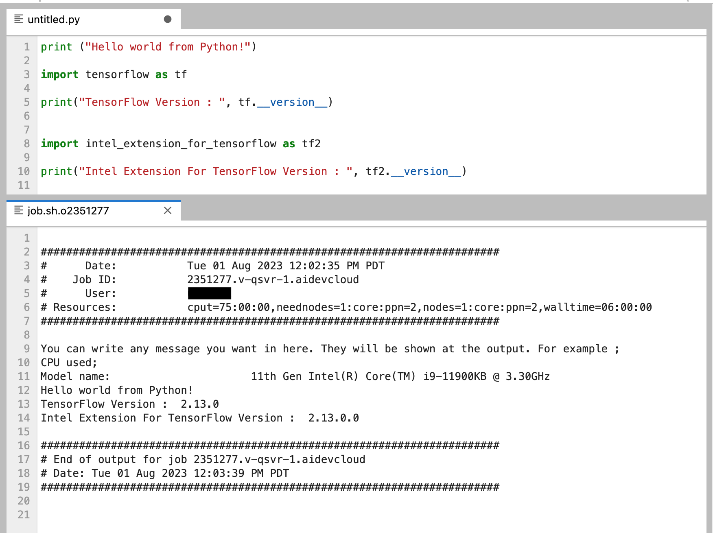

# Run the code and Job Script

Now we can choose the Kernel that we crated in the last step. On the top menu; Kernel-->Change Kernel-->my_tensorflow



Then we can run the codes cell by cell. But there is a better way to run our codes ; **Job queue**.

---

</br>

# Job queue

## 1 - Convert Jupyter Notebook

This is the only method for accessing the full capacity of the computing resources available on the DevCloud. First we should create **_job.sh_** file and then submit it to the queue. _(This is the only supported method, when I created this documentation)_

Now suppose that, we created our project in Jupyter notebook. We should convert it into Python script. First we should install the package _"nbconvert"_ ; 

_(Note : We should be in the folder where our Jupyter notebook is located)_

```
pip install nbconvert
```

```
jupyter nbconvert --to script "Name_of_your_file.ipynb"
```

</br>

_(Note : It is not necessary to install packages in virtual environment. We can also install them in Jupyter notebook cell by putting "!" symbol before the command. The below figure shows this method)_

<p align="center">

</p>
  
</br>
</br>

## 2 - Creating a Job Script

We can simply open a new Jupyter notebook in the same directory and in a cell, we can run the following command. **_job.sh_** will be created in the current directory. 

```
%%writefile job.sh
echo "You can write any message you want in here. They will be shown at the output. For example ;"
echo "CPU used;"
lscpu | grep "Model name"
source activate my_tensorflow  #We should activate the kernel which has all necassary packages
python untitled.py  #This Python scripts contains our codes and it will be run
```
</br>
</br>

## 3 - Submit Job to queue

This will submit the job script to the first available CPU core ; 
```
!qsub -l nodes=1:core:ppn=2 -d . job.sh
```

Or the below command, assign 1 full GPU node to our task _(job.sh)_ and save the outputs in current directory _(-d .)_
```
qsub -l nodes=1:gpu:ppn=2 -d . job.sh
```
</br>

The more details about "job" commands _(target specific GPU or node etc.)_ can be found in their [documentation website.](https://devcloud.intel.com/oneapi/documentation/job-submission/#listing-compute-node-properties)

</br>
</br>
</br>

Submitting can be done in two ways:
- **1 :** In a Jupyter notebook(it should be in the same directory with job.sh file). "!" symbol should be added before the commmand.
<p align="center">

</p>

</br>
</br>

- **2 :** From terminal via SSH
  
  After we connect to DevCloud with `ssh devcloud` command, we should change directory to the where _job.sh_ file is.
  Then we can run the above commands as seen in the below figure.
<p align="center">

</p>

</br>
</br>

## 4 - Output

When we submit the task, this gives us a Job ID _(e.g. "2351275" in this case)_ and the process might takes some time depends on the server. We can find the current status of the job by running `!qstat` command in the cell or `qstat` in the terminal.  

The _"Q"_ in the column _"S"_ shows that it is waiting in the queue, _"R"_ shows it is running. According to the code, after some time it will create 2 files and save in current directory.

-  [Job Name].o[Job ID]  (for example -> job.sh.o2351275)  Shows output of our Python Script.
-  [Job Name].e[Job ID]  (for example -> job.sh.e2351275)  Shows the errors during the running process.

</br>

For example, the below figure shows ; The Python script that we send to the queue and its output file after running in the server.

<p align="center">

</p>


</br>
</br>

If we want to download file from DevCloud _(saved model, output or error files etc.)_, In Jupyter Lab, we can easily use the menu on the left. But if we are using SSH, we need to use  ;

```
scp devcloud:<file_path> <saving_directory_in_your_computer>

For example in my case, the following command saves the output file of job_2351275, into current directory in my computer.
scp devcloud:~/my_trials/job.sh.02351275 ./
```


