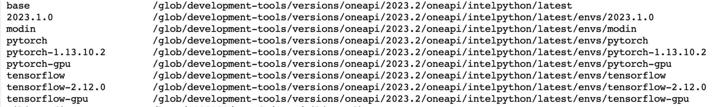

# Setting up the Kernel

First, we should open a new terminal, by following File-->New-->Terminal

I suggest to start with `conda init bash` so that use the all conda commands without problems. _(For example, when this command wasn't used, "conda activate venv" does not work, we should use "source activate venv" and etc.)_


Intel DevCloud has already created virtual environment as shown in the below._(They can be seen with `conda env list` command)_ 



We can start by cloning one of them according to our use case. Since I will create models with Keras, I cloned _"tensorflow"_

_(Note : When I worked on this project, at that times, pre-created "tensorflow-gpu" environment has conflict with some packages in the environment itself e.g. "jaxlib". Although they were fixed, later in the model training part, the error occurs about using the GPU. Therefore in the next parts, I continue with "tensorflow" environment and using the CPU option)_  

### 1 - Create virtual environment 
This command clone the _tensorflow_ into new created virtual environment; _my\_tensorflow_ 
``` 
conda create --name my_tensorflow --clone tensorflow
```

  
### 2 - Activate
Now, we should install the necessary packages that we will use in our projects. So we can activate the virtual environment :
``` 
conda activate my_tensorflow
```


  if there is a problem with conda command, the following way can be also used to activate the environment :
``` 
source activate my_tensorflow
```

### 3 - Install packages
First, TensorFlow should be updated, because the pre-created tensorflow environment has _"tensorflow version 2.12.0"_. But we should have _tensorflow 2.13.0_ as seen in the [documentation](https://intel.github.io/intel-extension-for-tensorflow/latest/get_started.html)
```
pip install --upgrade tensorflow
```


According to the project, necassary packages should be installed. For example, intel optimized tensorflow is not preinstalled. So it can be installed with command:  
```
pip install --upgrade intel-extension-for-tensorflow[cpu]
```


Its installation can be checked with : 
```
python -c "import intel_extension_for_tensorflow as itex; print(itex.__version__)"
```

All other packages should be installed in this way. For example in my case, _"tqdm"_ package was missing too. Therefore, it was installed with `pip install --upgrade tqdm` command.


### 4 - Create new kernel
Now we can create a new kernel for the Jupyter notebook based on the new conda environment. _(If we run our Python script in terminal via SSH, this part is not necessary)_
```
conda install ipykernel
```

```
python -m ipykernel install --user --name my_tensorflow
```
