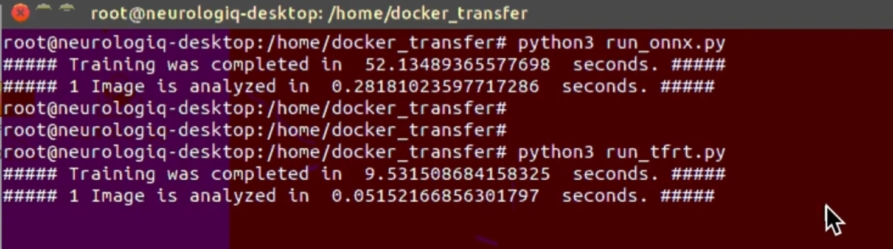

# Model Inference on Jetson Nano

## Convert ONNX Models into TensorRT Format

_(I assume that, you completed the Installation/NVIDIA Jetson Nano and Docker container is running.)_

First, you should start with converting ONNX models into TensorRT format. I created script file which automatically completes the entire process. You should first make this script executable : 
```
chmod +x _convert_to_tfrt.sh
```

Later you can directly run it : 
```
./_convert_to_tfrt.sh
```

When it converts the onnx models, at he output you should see  **"&&&& PASSED TensorRT.trtexec"**

<p align="center">

</p>

---
</br>

## Run ONNX Model
I divided to code into sections, mainly they are : 

- Import Libraries
- Load Model
- Model Inference Function
- Run model on test images
</br>

- **Some Details :**
  - Since the first layer is a Convolutional Layer, input data should have 4 dimension. So the images are resized in this way ;  
     **`1, img_height, img_width, channel(3)`**

  - When we created the dataset, data normalization was applied. Therefore, when we tun the model on test image, wew should do the same things and divide the data into 255.0
 
<p align="center">

</p>

---
</br>


## Run TensorRT Model

TensorRT models have similar structure and codes like above, but there 2 extra part. 

- **Variables**
  - `PRECISION = np.float32`  FP32 is the default training precision of most frameworks. But there are another possibilities. If they are used in ONNX model converting step, it should be mentioned in here.

</br>
 
- **Warmup**
  - TensorRT Model requires to warmup and then available for prediction. Therefore, we give some random inputs and run it.

<p align="center">

</p>

---
</br>

## Results

The test image folder contain 5 folders and each of them has 37 images. Therefore there are 185 test images in total. As a result TensorRT models is more than 5 times faster than ONNX model


|                      | ONNX Model    | TesnorRT Model |
|----------------------|---------------|----------------|
| All Test Images(185) | 52.13 seconds | 9.53 seconds    |
| 1 Image              | 0.281 seconds | 0.051 seconds  |




