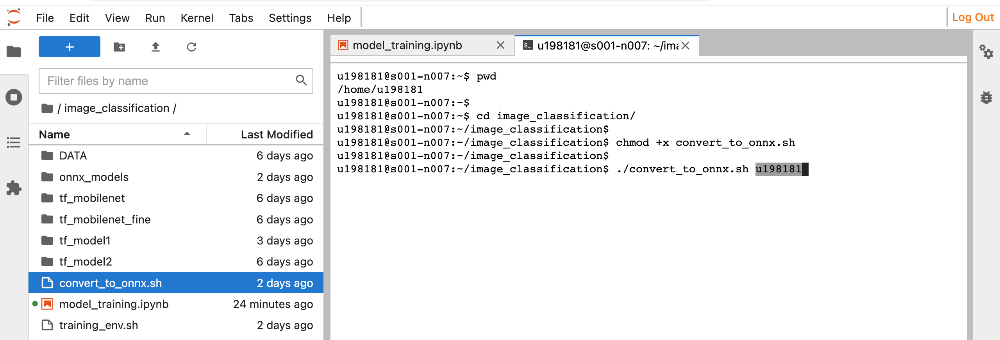

# Model Training

You can simply follow the `model_training.ipynb` notebook and run it cell by cell. This notebook has the following structure : 

- Import Libraries
- Set Global Variables
- Helper Functions
- 
- Prepare Dataset
  - Read Path and Show Data
  - Split Data into Train, Validation and Test
  - Data Augmentation
  - Normalization
  - Configure the dataset for performance
- 
- Train Custom CNN Model
- - Model 1
- - Model 2
- 
- Transfer Learning with pretrained MobileNet V2
  - Base Model + New Classifier
  - Fine tuning

---

</br>

Some details about the sections : 

### Set Global Variables
You should modify the path variables accordign to your account. If you want to use this notebook with different dataset, you should also modify the other parts such as class number etc.

</br>

### Prepare Dataset
This part shows, creating the Dataset from very beginning to the final result with all necessary operations. In this section data is read from folders and split into training, validation and test subsets. It also applies some data augmentation techniques to increase the amount of data. Later it normalizes the data by converting all elements between 0 and 1. Lastly some methods are applied to increase the performance during the training.

</br>

### Train Custom CNN Model
Model training part starts with custom CNN. First a simple structure is used and later it is improved by adding more layers.

</br>

### Transfer Learning with pretrained MobileNet V2
Lastly, MobileNet V2 is trained. First, only the last classification layer is trained. Later, with the fine tuning, some layers of bse model are also trained. In this way accuracy is increased.

---
</br>

# Convert TensorFlow Model into ONNX Format

`convert_to_onnx.sh` script will handle the all conversation process automatically. You should open the terminal and go to the directory where the script located is, then : 
```
chmod +x convert_to_onnx.sh
```

</br>

You should run the script, **BUT Do Not Forget** to write your **User ID**(starts with "u") as argument. This is the only requirement, other parts will be adjusted according to this automatically.
```
./convert_to_onnx.sh u------
```

<p align="center">

</p>

This will take some time and then you can see the ONNX models under the folder "onnx_models". Now you can continue with [Model Inference on Jetson Nano](model_inference_on_nano.md) and run the models.
